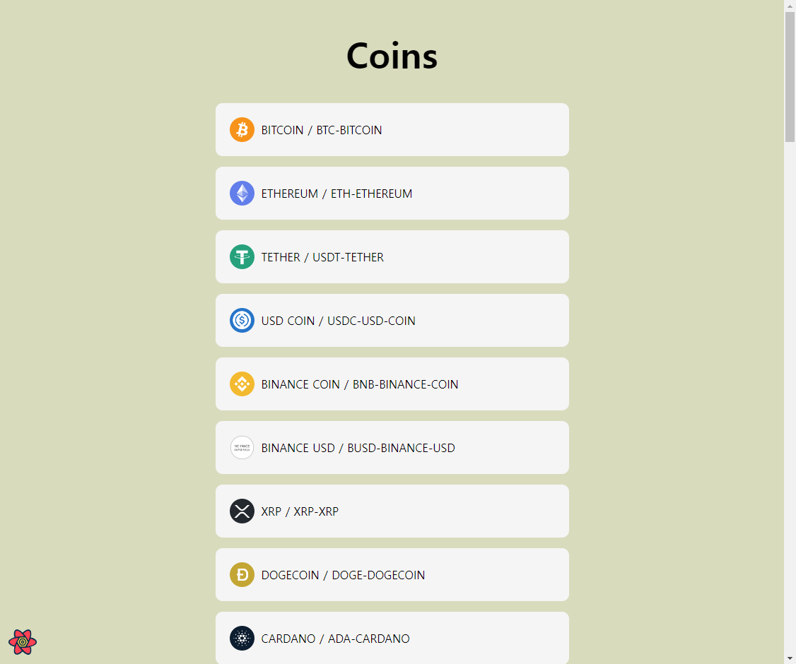
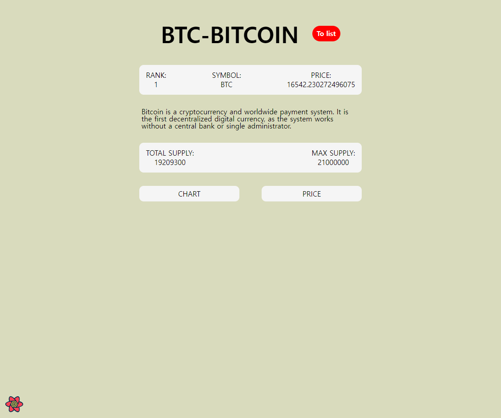
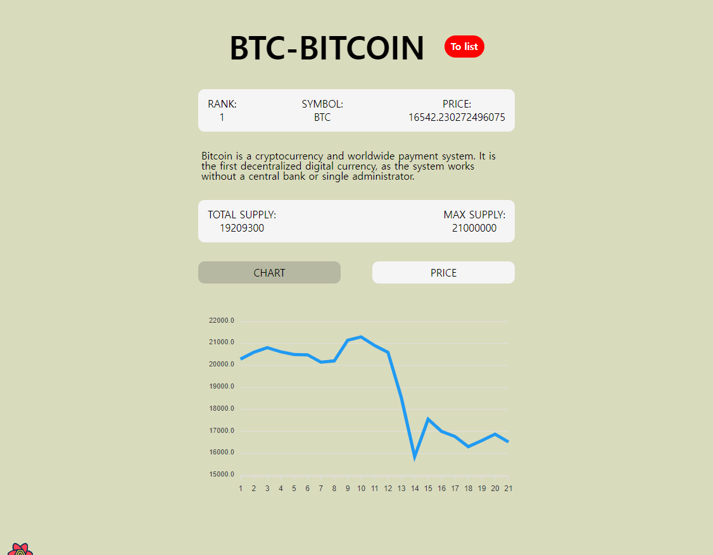
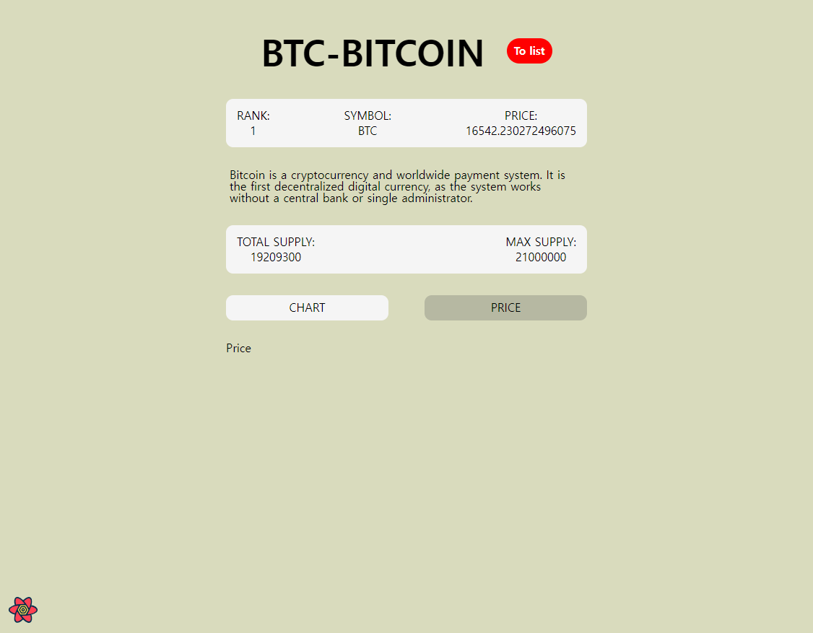

# React Coinmarket

### Using:

- Styled Components
- React Query
- React Router DOM
- Apex Charts

### Pages:

- Home(Coins): /
- Coin: /:coinId
  - Chart: /:coinId/price
  - Price: /:coinId/chart

### Screens:

<!--  -->

#### Main

#### Coin

</img>

#### Chart

</img>

#### Price(To fixed)

</img>
